# Entity Relationship Diagram — LMS Platform

> Generated from the Software Architecture Document (SAD) v1.0

```mermaid
erDiagram
    %% ─── USER DOMAIN ───────────────────────────────────────────────────────────
    users {
        UUID id PK
        VARCHAR email UK
        VARCHAR password_hash
        VARCHAR full_name
        TEXT avatar_url
        TEXT bio
        ENUM role "ADMIN | TEACHER | STUDENT"
        ENUM status "ACTIVE | PENDING_APPROVAL | SUSPENDED | REJECTED"
        BOOLEAN email_verified
        TIMESTAMPTZ created_at
        TIMESTAMPTZ updated_at
    }

    oauth_accounts {
        UUID id PK
        UUID user_id FK
        VARCHAR provider "google | github"
        VARCHAR provider_account_id
        TIMESTAMPTZ created_at
    }

    notifications {
        UUID id PK
        UUID user_id FK
        VARCHAR type
        TEXT message
        BOOLEAN is_read
        TIMESTAMPTZ created_at
    }

    %% ─── COURSE DOMAIN ──────────────────────────────────────────────────────────
    categories {
        UUID id PK
        VARCHAR name UK
        VARCHAR slug UK
        TEXT description
        TEXT icon_url
        BOOLEAN is_active
        TIMESTAMPTZ created_at
    }

    courses {
        UUID id PK
        VARCHAR title
        VARCHAR slug UK
        TEXT description
        VARCHAR short_desc
        TEXT thumbnail_url
        TEXT preview_url
        ENUM type "RECORDED | LIVE"
        ENUM status "DRAFT | PENDING_REVIEW | PUBLISHED | ARCHIVED"
        ENUM level "BEGINNER | INTERMEDIATE | ADVANCED"
        VARCHAR language
        DECIMAL price
        DECIMAL discount_price
        INTEGER access_duration "days; NULL=lifetime"
        UUID author_id FK
        UUID category_id FK
        BOOLEAN is_featured
        VARCHAR seo_title
        VARCHAR seo_description
        TEXT og_image_url
        TIMESTAMPTZ created_at
        TIMESTAMPTZ updated_at
    }

    course_tags {
        UUID id PK
        UUID course_id FK
        UUID tag_id FK
    }

    tags {
        UUID id PK
        VARCHAR name UK
        VARCHAR slug UK
    }

    modules {
        UUID id PK
        UUID course_id FK
        VARCHAR title
        INTEGER order
        TIMESTAMPTZ created_at
    }

    lessons {
        UUID id PK
        UUID module_id FK
        VARCHAR title
        ENUM type "VIDEO | ARTICLE | QUIZ | LIVE_SESSION"
        INTEGER order
        TEXT video_url
        INTEGER duration "seconds"
        TEXT content "HTML for articles"
        BOOLEAN is_preview
        TIMESTAMPTZ created_at
    }

    lesson_attachments {
        UUID id PK
        UUID lesson_id FK
        VARCHAR label
        TEXT file_url
        VARCHAR file_type "pdf | link | docx"
        TIMESTAMPTZ created_at
    }

    %% ─── LIVE SESSION DOMAIN ────────────────────────────────────────────────────
    live_sessions {
        UUID id PK
        UUID lesson_id FK
        UUID course_id FK
        UUID teacher_id FK
        VARCHAR title
        TIMESTAMPTZ scheduled_at
        INTEGER duration "minutes"
        ENUM platform "ZOOM | GOOGLE_MEET"
        TEXT join_url
        TEXT host_url
        ENUM status "SCHEDULED | LIVE | ENDED | CANCELLED"
        TEXT recording_url
        TIMESTAMPTZ created_at
    }

    %% ─── ENROLLMENT & PROGRESS DOMAIN ──────────────────────────────────────────
    enrollments {
        UUID id PK
        UUID student_id FK
        UUID course_id FK
        UUID order_id FK
        TIMESTAMPTZ enrolled_at
        TIMESTAMPTZ expires_at "NULL = lifetime"
        ENUM status "ACTIVE | EXPIRED | REVOKED"
    }

    lesson_progress {
        UUID id PK
        UUID enrollment_id FK
        UUID lesson_id FK
        DECIMAL watch_percent
        BOOLEAN is_completed
        TIMESTAMPTZ last_watched_at
    }

    certificates {
        UUID id PK
        UUID enrollment_id FK
        UUID student_id FK
        TEXT pdf_url
        VARCHAR certificate_number UK
        TIMESTAMPTZ issued_at
    }

    reviews {
        UUID id PK
        UUID student_id FK
        UUID course_id FK
        INTEGER rating "1-5"
        TEXT comment
        BOOLEAN is_approved
        TIMESTAMPTZ created_at
        TIMESTAMPTZ updated_at
    }

    wishlists {
        UUID id PK
        UUID student_id FK
        UUID course_id FK
        TIMESTAMPTZ added_at
    }

    %% ─── E-COMMERCE DOMAIN ──────────────────────────────────────────────────────
    coupons {
        UUID id PK
        VARCHAR code UK
        ENUM type "PERCENT | FIXED"
        DECIMAL value
        DECIMAL min_order_amount
        INTEGER max_uses
        INTEGER used_count
        TIMESTAMPTZ expires_at
        BOOLEAN is_active
        TIMESTAMPTZ created_at
    }

    orders {
        UUID id PK
        UUID student_id FK
        DECIMAL total_amount
        VARCHAR currency
        ENUM status "PENDING | COMPLETED | REFUNDED | FAILED"
        ENUM payment_gateway "STRIPE | RAZORPAY"
        VARCHAR gateway_order_id
        VARCHAR gateway_payment_id
        UUID coupon_id FK
        DECIMAL discount_amount
        TIMESTAMPTZ created_at
    }

    order_items {
        UUID id PK
        UUID order_id FK
        UUID course_id FK
        DECIMAL price "snapshot at purchase time"
    }

    refunds {
        UUID id PK
        UUID order_id FK
        UUID processed_by FK "admin user id"
        DECIMAL amount
        VARCHAR reason
        VARCHAR gateway_refund_id
        TIMESTAMPTZ created_at
    }

    teacher_payouts {
        UUID id PK
        UUID teacher_id FK
        DECIMAL amount
        VARCHAR currency
        ENUM status "PENDING | PROCESSED | FAILED"
        TIMESTAMPTZ period_start
        TIMESTAMPTZ period_end
        TIMESTAMPTZ processed_at
        TIMESTAMPTZ created_at
    }

    %% ─── BLOG DOMAIN ────────────────────────────────────────────────────────────
    blog_categories {
        UUID id PK
        VARCHAR name UK
        VARCHAR slug UK
        TEXT description
        TIMESTAMPTZ created_at
    }

    blog_tags {
        UUID id PK
        VARCHAR name UK
        VARCHAR slug UK
    }

    blog_posts {
        UUID id PK
        VARCHAR title
        VARCHAR slug UK
        VARCHAR excerpt
        TEXT content "HTML from TipTap"
        TEXT featured_image
        UUID author_id FK
        UUID category_id FK
        ENUM status "DRAFT | PUBLISHED | SCHEDULED"
        TIMESTAMPTZ published_at
        TIMESTAMPTZ scheduled_for
        VARCHAR seo_title
        VARCHAR seo_description
        TEXT og_image_url
        TEXT canonical_url
        TIMESTAMPTZ created_at
        TIMESTAMPTZ updated_at
    }

    blog_post_tags {
        UUID id PK
        UUID post_id FK
        UUID tag_id FK
    }

    %% ─── CMS DOMAIN ─────────────────────────────────────────────────────────────
    pages {
        UUID id PK
        VARCHAR title
        VARCHAR slug UK
        JSONB blocks "array of content blocks"
        ENUM status "DRAFT | PUBLISHED"
        BOOLEAN in_nav
        VARCHAR nav_label
        VARCHAR seo_title
        VARCHAR seo_description
        TEXT og_image_url
        TIMESTAMPTZ created_at
        TIMESTAMPTZ updated_at
    }

    site_settings {
        UUID id PK
        VARCHAR key UK
        TEXT value
        VARCHAR type "string | json | boolean"
        TIMESTAMPTZ updated_at
    }

    media_library {
        UUID id PK
        UUID uploaded_by FK
        TEXT file_url
        VARCHAR file_name
        VARCHAR mime_type
        BIGINT file_size "bytes"
        TIMESTAMPTZ created_at
    }

    %% ═══════════════════════════════════════════════════════════════════════════
    %% RELATIONSHIPS
    %% ═══════════════════════════════════════════════════════════════════════════

    %% Users & Auth
    users ||--o{ oauth_accounts : "has"
    users ||--o{ notifications : "receives"

    %% Courses
    users ||--o{ courses : "teaches (author)"
    categories ||--o{ courses : "classifies"
    courses ||--o{ course_tags : "tagged via"
    tags ||--o{ course_tags : "used in"
    courses ||--o{ modules : "contains"
    modules ||--o{ lessons : "contains"
    lessons ||--o{ lesson_attachments : "has"

    %% Live Sessions
    lessons ||--o| live_sessions : "linked to"
    courses ||--o{ live_sessions : "hosts"
    users ||--o{ live_sessions : "conducts (teacher)"

    %% Enrollment & Progress
    users ||--o{ enrollments : "enrolls (student)"
    courses ||--o{ enrollments : "enrolled into"
    orders ||--o{ enrollments : "grants"
    enrollments ||--o{ lesson_progress : "tracks"
    lessons ||--o{ lesson_progress : "tracked by"
    enrollments ||--o| certificates : "earns"
    users ||--o{ reviews : "writes (student)"
    courses ||--o{ reviews : "receives"
    users ||--o{ wishlists : "maintains"
    courses ||--o{ wishlists : "saved in"

    %% E-Commerce
    users ||--o{ orders : "places (student)"
    coupons ||--o{ orders : "applied to"
    orders ||--o{ order_items : "contains"
    courses ||--o{ order_items : "purchased via"
    orders ||--o| refunds : "refunded via"
    users ||--o{ teacher_payouts : "receives (teacher)"

    %% Blog
    users ||--o{ blog_posts : "authors"
    blog_categories ||--o{ blog_posts : "categorizes"
    blog_posts ||--o{ blog_post_tags : "tagged via"
    blog_tags ||--o{ blog_post_tags : "used in"

    %% CMS / Media
    users ||--o{ media_library : "uploads"
```

---

## Entity Summary

| Domain | Entities | Key Relationships |
|--------|----------|-------------------|
| **User** | `users`, `oauth_accounts`, `notifications` | Central hub — linked to almost every domain |
| **Course** | `categories`, `courses`, `tags`, `course_tags`, `modules`, `lessons`, `lesson_attachments` | Hierarchical: Category → Course → Module → Lesson |
| **Live Session** | `live_sessions` | Linked to both a `lesson` and a `course`; teacher is a `user` |
| **Enrollment & Progress** | `enrollments`, `lesson_progress`, `certificates`, `reviews`, `wishlists` | Student activity tracking per course |
| **E-Commerce** | `coupons`, `orders`, `order_items`, `refunds`, `teacher_payouts` | Full purchase lifecycle from cart to payout |
| **Blog** | `blog_categories`, `blog_posts`, `blog_tags`, `blog_post_tags` | Separate content domain linked by author |
| **CMS** | `pages`, `site_settings`, `media_library` | Platform configuration and static content |

> [!NOTE]
> All primary keys use `UUID` generated server-side (`gen_random_uuid()`). All junction tables (`course_tags`, `blog_post_tags`) use composite unique constraints. Soft-deletes via `status` fields are preferred over hard `DELETE` for audit integrity.
